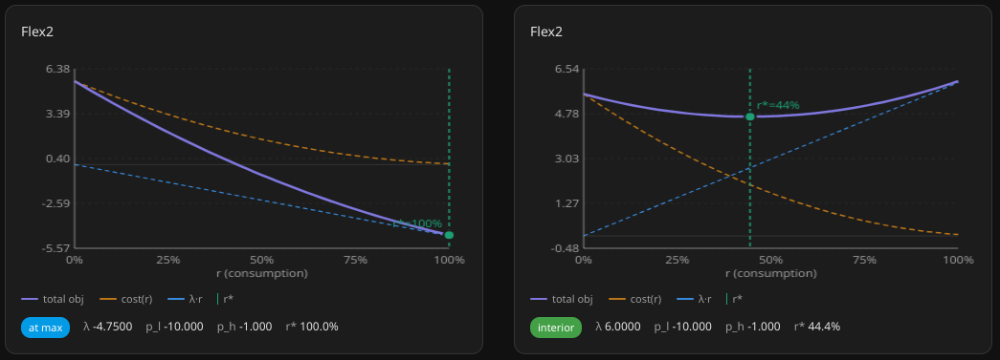

# HomeAssistant Flex2 Integration
Proof of concept HomeAssistant integration that provides a dis-utility curve for controlling devices that accept a [0-1] continuous range power control input (or convert [0,1] to desired range like stepping or 0-100%). Basically provides a transform from a scalar price sensor to the range [0,1].

Only one dis-utility curve is currently modelled: a quadratic with two tuning parameters, `p_l`, `p_h` that give the marginal dis-utility at 0 and 1 respectively. To create a sensor you also need to provide a price input sensor id.

Also provides a card for vizualizing Flex2 sensors.

